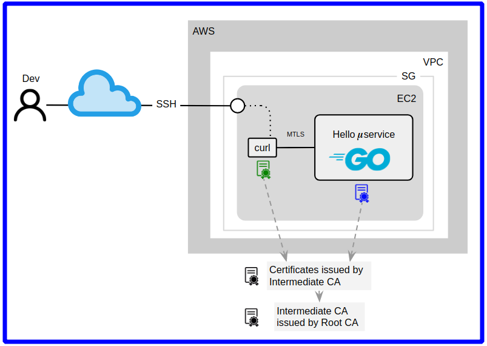

# Example 2. Enabling MTLS on Go-based Microservices

This is a simple REST microservice based on Go 1.13.8 create to demonstrate how to configure Mutual TLS authentication (Two-way TLS) using TLS certificates issued for Intermediate Certificate Authority.



This example is based on [Nick Jackson's MTLS Example GitHub repo](https://github.com/nicholasjackson/mtls-go-example), only I've tweaked a little bit:
- Set TLS port as parameter.
- Generate all private key with passphrase.
- Generate PKCS12 files.
- Able to read encrypted server private key to run HTTPS.

## Tools used

* Go
* OpenSSL

### Components

* `hello.go` - microservice implementation, listen on `9443` port by default.
* `openssl_gen_certs.sh` - create Root, Intermediate, client and server certificates using OpenSSL.
* `openssl_root.cnf` - OpenSSL template to generate Root certificate.
* `openssl_intermediate.cnf` - OpenSSL template to generate Intermediate certificate.


## Steps

### 1. Generate Root CA, Intermediate CA, server and client certificate

1. Cleaning.   

```sh
$ cd mtls-apps-examples/2-hello.go
$ ./openssl_gen_certs.sh cleanup
```

2. Generate all certificates needed for the `localhost` domain with the passphrase `secret`.

> You can use other different domain rather `localhost`, if so, that domain must be able to resolve through the available DNS server. If you don't have a DNS server, a workaround is adding that domain name to `/etc/hosts` file.

```sh
$ ./openssl_gen_certs.sh localhost secret

$ tree .
.
├── 1_root
│   ├── certs
│   │   └── ca.cert.pem
│   ├── index.txt
│   ├── index.txt.attr
│   ├── index.txt.old
│   ├── newcerts
│   │   └── 100212.pem
│   ├── private
│   │   └── ca.key.pem
│   ├── serial
│   └── serial.old
├── 2_intermediate
│   ├── certs
│   │   ├── ca-chain.cert.pem
│   │   └── intermediate.cert.pem
│   ├── csr
│   │   └── intermediate.csr.pem
│   ├── index.txt
│   ├── index.txt.attr
│   ├── index.txt.attr.old
│   ├── index.txt.old
│   ├── newcerts
│   │   ├── 100212.pem
│   │   └── 100213.pem
│   ├── private
│   │   └── intermediate.key.pem
│   ├── serial
│   └── serial.old
├── 3_application
│   ├── certs
│   │   └── localhost.cert.pem
│   ├── csr
│   │   └── localhost.csr.pem
│   └── private
│       └── localhost.key.pem
├── 4_client
│   ├── certs
│   │   └── localhost.cert.pem
│   ├── csr
│   │   └── localhost.csr.pem
│   └── private
│       └── localhost.key.pem
├── hello.go
├── openssl_gen_certs.sh
├── openssl_intermediate.cnf
├── openssl_root.cnf
└── README.md
```

### 2. Test One-way TLS

#### 1. Run the microservice.   

```sh
$ go version
go version go1.13.8 linux/amd64

$ go run -v hello.go -domain localhost
```

#### 2. From other terminal call the microservice.   

```sh
$ cd mtls-apps-examples/2-hello.go
$ curl -i --cacert 2_intermediate/certs/ca-chain.cert.pem https://localhost:9443/

HTTP/2 200 
content-type: text/plain
content-length: 13
date: Wed, 17 Feb 2021 20:34:45 GMT

Hello World 
```

The `2_intermediate/certs/ca-chain.cert.pem` file contains Root and Intermediate certificates in `PEM` format, required to validate the server certificate that microservice sends during the TLS handshake.

### 3. Test Two-way TLS (Mutual TLS authentication)

#### 1. Start the microservice with MTLS enabled.   

```sh
$ go run -v hello.go -domain localhost -mtls true
```

#### 2. Call the microservice (using client private key).   

Call the endpoint providing the certificates generated for the client, for the server to validate the request the user must provide its certifcate and private key.

```sh
$ curl --cacert 2_intermediate/certs/ca-chain.cert.pem \
        --cert 4_client/certs/localhost.cert.pem \
        --key 4_client/private/localhost.key.pem \
        https://localhost:9443/

Enter PEM pass phrase:

Hello World 
```

You could pass to curl the passphrase used to encrypt the client private key through `curl --cert <certificate[:password]>`, in this way when calling through curl it doesn't prompt for the passphrase. 

```sh
$ curl --cacert 2_intermediate/certs/ca-chain.cert.pem \
        --cert 4_client/certs/localhost.cert.pem:secret \
        --key 4_client/private/localhost.key.pem \
        https://localhost:9443/

Hello World 
```

#### 3. Call the microservice (using client PKCS12 - key-pair).  

We can use a `PKCS12` client file containing certificate and its private key, and avoid pass the private key through the `--key 4_client/private/localhost.key.pem` parameter. 
So, let's get the PKCS12 file:   

```sh
$ openssl pkcs12 -export \
          -inkey 4_client/private/localhost.key.pem \
          -in 4_client/certs/localhost.cert.pem \
          -out 4_client/certs/localhost.p12 \
          -passin pass:secret \
          -passout pass:secret
```

Now, let's convert PKCS12 in DER format to PEM format.

```sh
$ openssl pkcs12 \
          -in 4_client/certs/localhost.p12 \
          -out 4_client/certs/localhost.p12.pem \
          -passin pass:secret \
          -passout pass:secret
```

And finally, let's to call the service without client private key (`4_client/private/localhost.key.pem`) and without certificate (`4_client/certs/localhost.cert.pem`) but using PKCS12 in PEM format only.

```sh
$ curl --cacert 2_intermediate/certs/ca-chain.cert.pem \
        --cert 4_client/certs/localhost.p12.pem:secret \
        https://localhost:9443/

Hello World 
```

#### 4. Testing MTLS using a browser.   

Like the [Greeting Java microservice](../1-greeting-java), you must install the client certificate and its corresponding private key in the browser, also must be installed the certificate chain and trust on those.   
The difficult is convert all those client certificate and private key, and certificate chain in a format that you browser support. Note that `openssl_gen_certs.sh` has generated all keys and certificates in `PEM` format, however the above openssl command already joined the client certificate and the private key in a `PKCS12` file. Only you need to import it to your browser, during this process the browser will ask for the passphrase, and that is all.


## References

* https://medium.com/@prateeknischal25/using-encrypted-private-keys-with-golang-server-379919955854
* https://gist.github.com/jshap70/259a87a7146393aab5819873a193b88c
