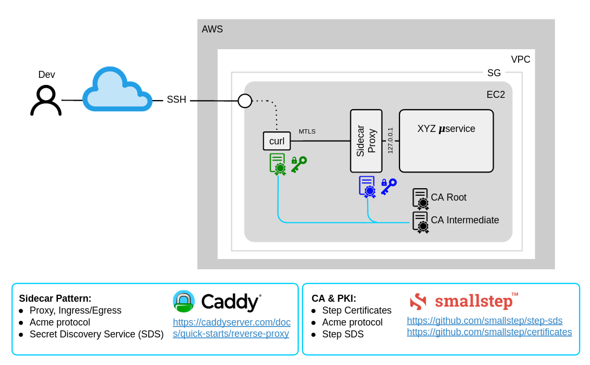
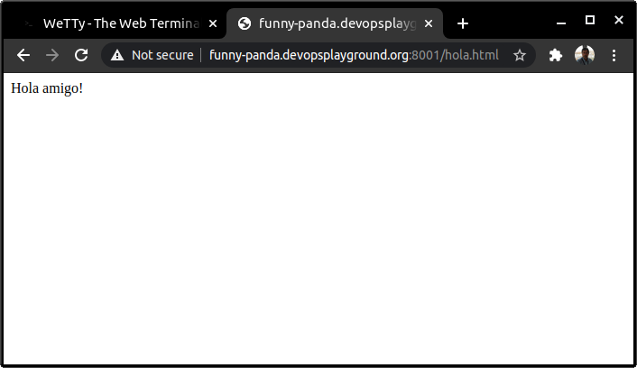

# Example 3. Using Caddy as Sidecar/Proxy for Microservices

Caddy as sidecar proxy for any kind of microservices to manage MTLS and Certificates




## Tools used

* Go
* Caddy v2 
* SmallStep Certificates (libraries already embeded in Caddy v2)
* Docker


## Preparation

Caddy can be installed as a Linux service, the [binary can be downloaded](https://caddyserver.com/download) and embedded in applications or use it in a [Docker Container](https://hub.docker.com/_/caddy). This latest option is the way we are going to use along this Lab.

#### Install Docker

If your workstation **doesn't have Docker installed and running**, please, follow these commands.

```sh
$ curl gnupg-agent software-properties-common
$ curl -fsSL https://download.docker.com/linux/ubuntu/gpg | sudo apt-key add -
$ sudo add-apt-repository "deb [arch=amd64] https://download.docker.com/linux/ubuntu $(lsb_release -cs) stable"
$ sudo apt update
$ sudo apt -y install -y docker-ce docker-ce-cli containerd.io
$ sudo usermod -a -G docker $USER
$ sudo systemctl enable docker
```

#### Caddy in Docker 

Once installed Docker we are ready to use Caddy. Then, lets download the Caddy docker image:  

```sh
$ docker pull caddy

Using default tag: latest
latest: Pulling from library/caddy
Digest: sha256:925100cc9e08c8d79ee37b36abe21d2f554982d5bf302c55a38f5da971f53431
Status: Image is up to date for caddy:latest
docker.io/library/caddy:latest
```

Checking the downloaded Caddy docker image.
```sh
$ docker images

REPOSITORY             TAG       IMAGE ID       CREATED        SIZE
caddy                  latest    88588539bb90   3 hours ago    39.5MB
codercom/code-server   latest    681a48e7bf50   3 weeks ago    838MB
wettyoss/wetty         latest    06a426b25e16   4 months ago   148MB
```
## Examples

### 1. Checking basic usage with Caddy in docker

#### 1. Serving static files with Caddy on HTTP.

Caddy is able to server static files and work as proxy at the same time. Lets check if Caddy using this feature: 
```sh
$ docker run -d -p 8001:80 \
    -v $PWD/1-basic/hola.html:/usr/share/caddy/hola.html \
    --name caddy1 \
    caddy
```

#### 2. Exploring Caddy docker process.
```sh
$ docker exec -it caddy2 ls -la /config/caddy/
total 12
drwxr-xr-x    2 root     root          4096 Mar  6 15:58 .
drwxr-xr-x    3 root     root          4096 Mar  6 15:58 ..
-rw-------    1 root     root           184 Mar  6 16:07 autosave.json

$ docker exec -it caddy2 ls -la /data/caddy/
total 8
drwxr-xr-x    2 root     root          4096 Mar  6 08:10 .
drwxr-xr-x    3 root     root          4096 Mar  6 11:31 ..

$ docker exec -it caddy2 ls -la /usr/share/caddy/
total 28
drwxr-xr-x    1 root     root          4096 Mar  6 16:02 .
drwxr-xr-x    1 root     root          4096 Mar  6 08:10 ..
-rw-r--r--    1 1001     root            12 Mar  6 15:12 hola.html
-rw-r--r--    1 root     root         12226 Mar  6 08:10 index.html
```

* `/config/caddy/` - It is the directory where the Caddy configuration is saved.
* `/data/caddy/` - It is the directory where the Caddy data (certificates, CA, etc.) is saved.
* `/usr/share/caddy/` - It is the directory where the static web page is saved.

#### 3. Checking if Caddy is serving static web page on the port `8001`:


```sh
$ curl -i http://localhost:8001/hola.html

HTTP/1.1 200 OK
Accept-Ranges: bytes
Content-Length: 12
Content-Type: text/html; charset=utf-8
Etag: "qpjzl3c"
Last-Modified: Sat, 06 Mar 2021 15:12:39 GMT
Server: Caddy
Date: Sat, 06 Mar 2021 15:19:21 GMT

Hola amigo!
```

And from a browser:




#### 4. Checking the running Caddy docker processes

```sh
$ docker ps

CONTAINER ID   IMAGE                         COMMAND                  CREATED          STATUS          PORTS                                     NAMES
a3ba303fbe6e   caddy                         "caddy run --config …"   59 seconds ago   Up 59 seconds   443/tcp, 2019/tcp, 0.0.0.0:8002->80/tcp   caddy2
a433bf9e14c3   caddy                         "caddy run --config …"   4 minutes ago    Up 4 minutes    443/tcp, 2019/tcp, 0.0.0.0:8001->80/tcp   caddy1
```

Remove recently created container:  
```sh
$ docker rm -f caddy1 caddy2
```

### 2. Advanced Caddy configurations.


#### 1. Overwriting the Caddy config file

Running Caddy instance over the `8002` port, overwriting the Caddy config file (`/etc/caddy/Caddyfile`) and mounting `/data` and `/config` folders: 

```sh
$ cat $PWD/1-basic/Caddyfile.example1

:80

# Set this path to your site's directory.
root * /usr/share/caddy

# Enable the static file server.
file_server
```

```sh
$ docker run -d -p 8002:80 \
    -v $PWD/1-basic/hola.html:/usr/share/caddy/hola.html \
    -v $PWD/1-basic/Caddyfile.example1:/etc/caddy/Caddyfile \
    -v caddy_data:/data \
    -v caddy_config:/config \
    --name caddy2 \
    caddy

$ curl http://localhost:8002/hola.html

Hola amigo!
```


### 3. Checking automatic TLS with Caddy in docker

We are going to configure Caddy as a Proxy (no as `file_server`) listening on `9080` to expose Kuard running `9070` port.

#### 1. Running Kuard

```sh
$ docker run -d -p 9070:8080 \
    --name kuard \
    gcr.io/kuar-demo/kuard-amd64:1

$ curl localhost:9070/healthy

ok
```
And from your browser, you should see this:


#### 2. Update Caddyfile

```sh
$ cat $PWD/1-basic/Caddyfile.example2

:9080

# Set this path to your site's directory.
root * /usr/share/caddy

# Another common task is to set up a reverse proxy:
reverse_proxy localhost:9070
```

#### 3. Running Caddy as Proxy

```sh
$ docker run -d -p 9090:9080 \
    -v $PWD/1-basic/Caddyfile.example2:/etc/caddy/Caddyfile \
    -v caddy_data:/data \
    -v caddy_config:/config \
    --name caddy3 \
    caddy
```

Checking the caddy docker processes:
```sh
$ docker ps -a

```

#### 4. Checking Kuard being proxied through Caddy.

From your local computer:

```sh
$ curl http://funny-panda.devopsplayground.org:9090/:9070/healthy
```


### 3. Test Two-way TLS (Mutual TLS authentication)

TBC

## References

* JSON schema generator for Caddy v2
   - https://github.com/abiosoft/caddy-json-schema

